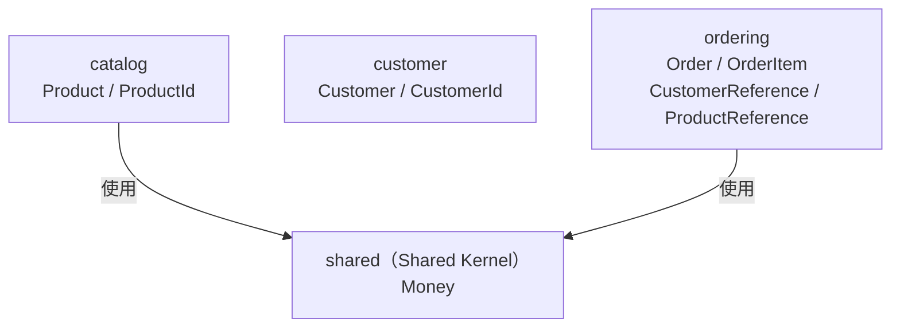

# Bounded Context 與跨 Context 實作

本文件對應 [DDD 核心概念](01-ddd.md) 的 Bounded Context、Shared Kernel 與跨 Context 資料存取模式。

---

## Bounded Context 與 Shared Kernel



**型別歸屬：**

| 型別 | 位置 | 說明 |
|---|---|---|
| `Money` | `shared/` | 金額 VO；`catalog` 定價、`ordering` 訂單項目都需要，語義完全一致 → 放 Shared Kernel |
| `CustomerId` | `customer/domain/` | customer context 自用；`ordering` 不 import，改用 `CustomerReference(UUID)` |
| `ProductId` | `catalog/domain/` | catalog context 自用；`ordering` 不 import，改用 `ProductReference(UUID)` |

`Money` 若留在 `catalog.domain`，`ordering` 就必須依賴 `catalog` 的內部 package，Spring Modulith 會偵測為模組邊界違規。移至 Shared Kernel 後，雙方都可合法使用。

`CustomerId` / `ProductId` 語義上屬於各自的 Context，不放 Shared Kernel。`ordering` 透過 Reference 物件以 UUID 參照，完全不 import 其他 Context 的型別。

---

## 跨 Context 邊界

`ordering` 需要記錄「這筆訂單屬於哪個顧客」、「這個訂單項目是哪個商品」，
但 `ordering.domain` **不 import** 任何其他 Context 的型別。

### Reference 物件

在 `ordering/domain/` 定義兩個包裝 UUID 的 `@ValueObject`：

```java
@ValueObject public record CustomerReference(UUID id) {}
@ValueObject public record ProductReference(UUID id) {}
```

**不實作 `Identifier` 的原因**：jMolecules ByteBuddy 會對所有實作 `Identifier` 的欄位加上 `@Id`。
若 `CustomerReference implements Identifier`，`Order` 裡就有兩個 `@Id`（`OrderId` + `CustomerReference`），MongoDB 啟動時會拋出 `MappingException`。

**不用 `Association<Customer, CustomerId>` 的原因**：jMolecules ArchUnit DDD rules（v2025.0.2）會掃描泛型型別參數，
把 `Association<Customer, CustomerId>` 中的 `Customer`（implements `AggregateRoot`）誤判為「直接持有 AggregateRoot」，產生誤報。

### 使用方式

```java
// Order — 接受 UUID，包裝成 CustomerReference
public Order(UUID customerId) {
    this.customer = new CustomerReference(customerId);
}

// OrderItem — 接受 UUID，包裝成 ProductReference
public OrderItem(UUID productId, Quantity quantity, Money unitPrice) {
    this.product = new ProductReference(productId);
}
```

應用層（Command、Controller）直接使用 `UUID`，不需 import 其他 Context 的型別：

```java
@Command
public record CreateOrderCommand(UUID customerId) {}
```

### 違規展示

```java
// ❌ BadOrder.java — 直接持有 Customer 物件（跨越邊界）
public class BadOrder {
    private Customer customer;  // ordering 與 customer 緊耦合
}
```

---

## 讀取另一個 Context 的資料：publicapi Facade

若未來 `ordering` 建立訂單項目時需要讀取 `catalog` 的商品名稱與價格，不應直接 import：

```java
// ❌ ordering 不應依賴 catalog 的 internal package
import com.example.demo.catalog.application.ProductQueryModel;
import com.example.demo.catalog.domain.Product;
import com.example.demo.catalog.domain.ProductId;
import com.example.demo.catalog.domain.ProductRepository;
```

正確做法是在 owner Context 建立專門給其他 Bounded Context 使用的 `publicapi/` package。
因為 `publicapi` 是 sub-package，Spring Modulith 預設仍會視為 internal；要用 `@NamedInterface` 明確公開。

```java
// catalog/publicapi/package-info.java
@NamedInterface("public-api")
@ApplicationServiceRing
package com.example.demo.catalog.publicapi;

import org.jmolecules.architecture.onion.classical.ApplicationServiceRing;
import org.springframework.modulith.NamedInterface;
```

```java
// catalog/publicapi/ProductSummary.java
package com.example.demo.catalog.publicapi;

import java.math.BigDecimal;
import java.util.UUID;

public record ProductSummary(UUID id, String name, BigDecimal amount, String currency) {}
```

```java
// catalog/publicapi/ProductQueryFacade.java
package com.example.demo.catalog.publicapi;

import com.example.demo.catalog.application.ProductQueryModel;
import com.example.demo.catalog.domain.ProductId;
import java.util.Optional;
import java.util.UUID;
import org.springframework.stereotype.Component;

@Component
public class ProductQueryFacade {

    private final ProductQueryModel productQueryModel;

    public ProductQueryFacade(ProductQueryModel productQueryModel) {
        this.productQueryModel = productQueryModel;
    }

    public Optional<ProductSummary> findById(UUID id) {
        return productQueryModel
                .findById(new ProductId(id))
                .map(
                        product ->
                                new ProductSummary(
                                        product.getId().id(),
                                        product.getName(),
                                        product.getPrice().amount(),
                                        product.getPrice().currency()));
    }
}
```

`ProductQueryFacade` 可以依賴 `catalog.application` / `catalog.domain`，因為它仍在 `catalog` 模組內部。
`ordering` 依賴 `catalog.publicapi.ProductQueryFacade` 與 `catalog.publicapi.ProductSummary`
是一條明確的跨 Bounded Context 依賴，但不會違反 Spring Modulith：
`publicapi` 已被 `@NamedInterface` 公開，而 `Product`、`ProductId`、`ProductRepository` 仍留在 internal package。

```java
// ordering/application/OrderService.java
import com.example.demo.catalog.publicapi.ProductQueryFacade;
import com.example.demo.catalog.publicapi.ProductSummary;

@Service
public class OrderService {

    private final OrderRepository orderRepository;
    private final ProductQueryFacade productQueryFacade;

    public OrderService(OrderRepository orderRepository, ProductQueryFacade productQueryFacade) {
        this.orderRepository = orderRepository;
        this.productQueryFacade = productQueryFacade;
    }

    private ProductSummary findProduct(UUID productId) {
        return productQueryFacade
                .findById(productId)
                .orElseThrow(() -> new IllegalArgumentException("Product not found: " + productId));
    }
}
```

---

## 保存當下事實：OrderItem Snapshot

目前 `OrderItem` 保存 `ProductReference` 與 `unitPrice`：

```java
public class OrderItem implements Entity<Order, OrderItemId> {

    private ProductReference product;
    private Quantity quantity;
    private Money unitPrice;
}
```

若需求變成「訂單明細要顯示下單當下的商品名稱與成交價格」，可以讓 `ordering` 保存 snapshot：

```java
public class OrderItem implements Entity<Order, OrderItemId> {

    private ProductReference product;
    private String productNameSnapshot;
    private Money unitPriceSnapshot;
    private Quantity quantity;

    public OrderItem(UUID productId, String productName, Quantity quantity, Money unitPrice) {
        this.product = new ProductReference(productId);
        this.productNameSnapshot = productName;
        this.quantity = quantity;
        this.unitPriceSnapshot = unitPrice;
    }

    public Money subtotal() {
        return unitPriceSnapshot.multiply(quantity.value());
    }
}
```

這裡的 `productNameSnapshot` / `unitPriceSnapshot` 不再是 `catalog` 的資料副本，而是 `ordering` 的歷史事實：
商品日後改名或調價，不應改變已成立訂單的明細。

---

## 更新另一個 Context：Command Facade 或 Event

跨 Context update 不應直接拿對方 Repository，也不應直接改對方資料庫。
若需要同步知道成功或失敗，owner Context 可以在 `publicapi` 提供 Command Facade。
以下是「catalog 未來若支援庫存保留」時的概念草案，`ReserveStockCommand` 尚未在目前專案中實作：

```java
// catalog/publicapi/ProductCommandFacade.java
package com.example.demo.catalog.publicapi;

import com.example.demo.catalog.application.ProductService;
import java.util.UUID;
import org.springframework.stereotype.Component;

@Component
public class ProductCommandFacade {

    private final ProductService productService;

    public ProductCommandFacade(ProductService productService) {
        this.productService = productService;
    }

    public void reserveStock(UUID productId, int quantity) {
        // 範例：實際 command 需由 catalog 定義，規則仍由 catalog 自己執行
        productService.handle(new ReserveStockCommand(productId, quantity));
    }
}
```

若不需要同步結果，優先發布事件，讓對方 Context 自己訂閱並處理：

```text
ordering.domain.Order.place()
    -> OrderPlaced(orderId, occurredOn)
    -> repository.save(order)
    -> catalog / inventory listener reacts
```

事件被其他 Context 消費時，就成為跨 Context 合約；公開事件不要包含 owner 的 internal domain 型別。
