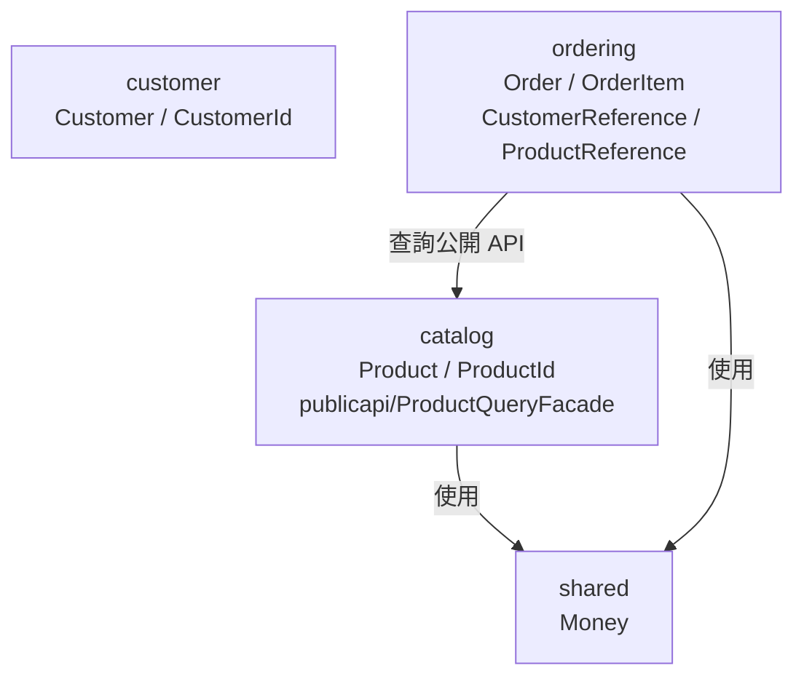

# Bounded Context 與跨 Context 實作

本文件對應 [DDD 核心概念](01-ddd.md) 的 Bounded Context、Shared Kernel 與跨 Context 資料存取模式。

閱讀這份文件時，先記住一個原則：

> 跨 Context 可以互動，但只能透過對方刻意公開的合約互動。

`ordering` 可以知道「訂單對應哪個 customer」、「訂單項目對應哪個 product」，也可以查詢商品名稱與價格。
但它不應該直接 import `customer.domain.Customer`、`catalog.domain.Product`、Repository 或 internal QueryModel。

---

## 先看結論

| 需求 | 本專案做法 | 避免做法 |
|---|---|---|
| 多個 Context 都需要同一個穩定概念 | 放進 `shared/`，例如 `Money` | 把某個 Context 的 domain type 拿給其他 Context 用 |
| 保存外部 Aggregate 的身分 | 在本 Context 建立 Reference Object，例如 `ProductReference(UUID)` | 直接持有 `Product` 或直接使用 `ProductId` |
| 讀取外部 Context 的展示資料 | 使用 owner Context 的 `publicapi` Facade，例如 `ProductQueryFacade` | import 對方的 QueryModel、Repository、domain model |
| 保存下單當下的商品名稱與價格 | 在 `OrderItem` 保存 snapshot | 每次顯示歷史訂單都查最新商品資料 |
| 通知其他 Context 發生了什麼事 | 發布 Domain Event，例如 `OrderPlaced` | 直接修改其他 Context 的資料庫 |
| 對接外部語言或資料模型 | 建立 Anti-Corruption Layer，轉成本 Context 的 Reference / Snapshot / Command | 讓外部 DTO、狀態 enum 或欄位命名進入 domain |

---

## Context 邊界長什麼樣



`Money` 放在 `shared/`，因為 `catalog` 的商品定價和 `ordering` 的訂單金額語義一致。
`ProductId` 和 `CustomerId` 留在各自 Context 內，因為它們是 owner Context 的 identity type。

| 型別 | 位置 | 說明 |
|---|---|---|
| `Money` | `shared/` | Shared Kernel；多個 Context 共用且語義一致 |
| `ProductId` | `catalog/domain/` | catalog 內部 identity；ordering 不 import |
| `CustomerId` | `customer/domain/` | customer 內部 identity；ordering 不 import |
| `ProductReference` | `ordering/domain/` | ordering 對 product 的參照 |
| `CustomerReference` | `ordering/domain/` | ordering 對 customer 的參照 |

---

## Step 1：用 Reference Object 保存關聯

`ordering` 需要記錄顧客與商品，但不持有對方 Aggregate。
做法是在 `ordering/domain/` 定義包裝 UUID 的 Value Object：

```java
@ValueObject
public record CustomerReference(UUID id) {}

@ValueObject
public record ProductReference(UUID id) {}
```

Aggregate 內只保存 reference：

```java
public class Order {
    private CustomerReference customer;
}

public class OrderItem {
    private ProductReference product;
}
```

不要這樣做：

```java
// ordering 不應該 import customer.domain.Customer
private Customer customer;

// ordering 也不直接使用 customer.domain.CustomerId
private CustomerId customerId;
```

### 為什麼不用 Identifier 或 Association？

`CustomerReference` / `ProductReference` 不實作 `Identifier`。
jMolecules ByteBuddy 會對所有實作 `Identifier` 的欄位加上 `@Id`；如果 `Order` 同時有 `OrderId` 和 `CustomerReference implements Identifier`，MongoDB 會看到兩個 `@Id`。

本專案也不使用 `Association<Customer, CustomerId>`。
jMolecules ArchUnit DDD rules 會檢查泛型參數，容易把 `Association<Customer, CustomerId>` 裡的 `Customer` 判定成直接持有外部 Aggregate。

---

## Step 2：用 publicapi 讀取外部資料

讀取外部 Context 的資料時，依賴 owner Context 公開的 API，不依賴它的內部實作。
這個 publicapi 同時扮演 Anti-Corruption Layer：把 owner Context 的資料轉成本 Context 能理解的穩定合約。

在 `catalog/publicapi/`：

| 檔案 | 角色 |
|---|---|
| [`package-info.java`](../src/main/java/com/example/demo/catalog/publicapi/package-info.java) | 用 `@NamedInterface("public-api")` 讓 Spring Modulith 知道這是公開介面 |
| [`ProductSummary.java`](../src/main/java/com/example/demo/catalog/publicapi/ProductSummary.java) | 跨 Context 回傳用 DTO |
| [`ProductQueryFacade.java`](../src/main/java/com/example/demo/catalog/publicapi/ProductQueryFacade.java) | 封裝 catalog 內部查詢方式 |

`ProductSummary` 是公開契約，所以欄位使用穩定型別：

```java
public record ProductSummary(UUID id, String name, BigDecimal amount, String currency) {}
```

`ProductQueryFacade` 可以依賴 `catalog.application` 和 `catalog.domain`，因為它仍然屬於 `catalog` 內部。
其他 Context 只看見 `catalog.publicapi`：

```java
import com.example.demo.catalog.publicapi.ProductQueryFacade;
import com.example.demo.catalog.publicapi.ProductSummary;
```

不要從 `ordering` import 這些 internal type：

```java
import com.example.demo.catalog.application.ProductQueryModel;
import com.example.demo.catalog.domain.Product;
import com.example.demo.catalog.domain.ProductId;
import com.example.demo.catalog.domain.ProductRepository;
```

其他 Context 拿到 `ProductSummary` 後，應立即轉成自己的語言。
例如 `ordering` 在建立訂單項目時保存 `ProductReference` 和商品 snapshot，而不是把 `ProductSummary` 長期存在 Aggregate 裡。

---

## Step 3：用 Snapshot 保存歷史事實

商品名稱與價格由 `catalog` 擁有，但「下單當下的商品名稱與成交價格」屬於 `ordering` 的訂單事實。
因此 `OrderItem` 保存 snapshot：

```java
public class OrderItem implements Entity<Order, OrderItemId> {

    private ProductReference product;
    private String productNameSnapshot;
    private Money unitPriceSnapshot;
    private Quantity quantity;

    public Money subtotal() {
        return unitPriceSnapshot.multiply(quantity.value());
    }
}
```

判斷是否需要 snapshot，可以問：

> 外部資料改變時，既有紀錄是否也應跟著改？

如果答案是否定的，就保存 snapshot。
商品日後改名或調價，不應改變已成立訂單的明細。

---

## Step 4：跨 Context update 用 Command Facade 或 Event

跨 Context update 的重點是：不要直接拿對方 Repository，也不要直接改對方資料庫。

依照 use case 選擇方式：

| 情境 | 做法 |
|---|---|
| 呼叫方需要同步知道成功或失敗 | owner Context 在 `publicapi` 提供 Command Facade |
| 呼叫方只需要宣告某件事已發生 | 發布事件，讓其他 Context 自己訂閱 |

本專案的事件流程：

```text
ordering.domain.Order.place()
    -> OrderPlaced(orderId, occurredOn)
    -> repository.save(order)
    -> interested listeners react
```

事件被其他 Context 消費時，就成為跨 Context 合約。
公開事件不要包含 owner 的 internal domain 型別。

### Domain Event vs Integration Event

| 類型 | 使用範圍 | 本專案規則 |
|---|---|---|
| Domain Event | Context 內部描述領域事實 | 可放在 `domain/`，用 `@DomainEvent record`，不可變 |
| Integration Event / Public Event | 跨 Context 或跨系統溝通 | 欄位只用穩定型別，不暴露 owner internal domain type |

當 `OrderPlaced` 只有 `ordering` 自己聽，它是 Domain Event。
當 `inventory`、`payment` 或外部系統開始依賴它，它就同時承擔公開合約責任；此時要考慮版本相容、欄位穩定性、事件重送與消費端冪等。

---

## 新增跨 Context 互動時的檢查清單

- 先確認資料 owner 是哪個 Context
- 不 import 對方的 `domain`、`application`、`repository` package
- 只透過 `publicapi`、事件或本地 Reference Object 互動
- 將外部模型透過 Anti-Corruption Layer 轉成本 Context 的語言
- Public DTO 不回傳 Aggregate、Entity、Repository、internal Value Object
- Public DTO 不重用 HTTP request / response DTO 或 OpenAPI generated model
- 跨 Context event 視為 Integration Event，欄位使用穩定型別並考慮版本相容
- 歷史資料需要穩定呈現時，在本 Context 保存 snapshot
- 新增公開合約後，補測試並跑架構驗證
