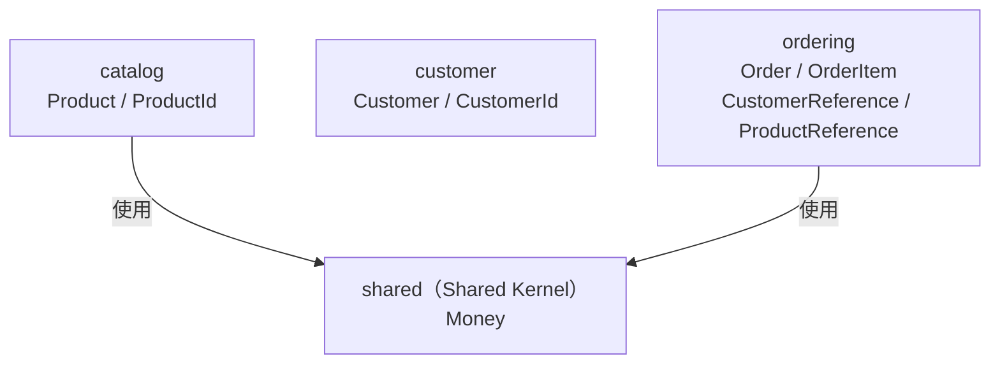

# DDD 實作說明 — 本專案對應

本文件說明本專案如何對應 [DDD 核心概念](01-ddd.md)。

---

## Building Blocks 對照

| 概念 | 本專案範例 |
|---|---|
| **Aggregate Root** | [`Order`](../src/main/java/com/example/demo/ordering/domain/Order.java)、[`Product`](../src/main/java/com/example/demo/catalog/domain/Product.java)、[`Customer`](../src/main/java/com/example/demo/customer/domain/Customer.java) |
| **Entity** | [`OrderItem`](../src/main/java/com/example/demo/ordering/domain/OrderItem.java)（隸屬 `Order`） |
| **Value Object** | [`Money`](../src/main/java/com/example/demo/shared/Money.java)、[`Address`](../src/main/java/com/example/demo/customer/domain/Address.java)、[`Quantity`](../src/main/java/com/example/demo/ordering/domain/Quantity.java) |
| **Domain Event** | [`OrderPlaced`](../src/main/java/com/example/demo/ordering/domain/OrderPlaced.java)、[`OrderCancelled`](../src/main/java/com/example/demo/ordering/domain/OrderCancelled.java) |
| **Repository** | [`OrderRepository`](../src/main/java/com/example/demo/ordering/domain/OrderRepository.java)、[`ProductRepository`](../src/main/java/com/example/demo/catalog/domain/ProductRepository.java) |
| **Domain Service** | [`PricingService`](../src/main/java/com/example/demo/ordering/domainservice/PricingService.java) |
| **Bounded Context** | `catalog`、`customer`、`ordering` |
| **Shared Kernel** | [`shared/`](../src/main/java/com/example/demo/shared/)（`Money`） |

---

## Bounded Context 與 Shared Kernel



**型別歸屬：**

| 型別 | 位置 | 說明 |
|---|---|---|
| `Money` | `shared/` | 金額 VO；`catalog` 定價、`ordering` 訂單項目都需要，語義完全一致 → 放 Shared Kernel |
| `CustomerId` | `customer/domain/` | customer context 自用；`ordering` 不 import，改用 `CustomerReference(UUID)` |
| `ProductId` | `catalog/domain/` | catalog context 自用；`ordering` 不 import，改用 `ProductReference(UUID)` |

`Money` 若留在 `catalog.domain`，`ordering` 就必須依賴 `catalog` 的內部 package——Spring Modulith 會偵測為模組邊界違規。移至 Shared Kernel 後，雙方都可合法使用。

`CustomerId` / `ProductId` 語義上屬於各自的 Context，不放 Shared Kernel。`ordering` 透過 Reference 物件（見下方）以 UUID 參照，完全不 import 其他 Context 的型別。

---

## Onion Architecture 分層

→ 本專案的 ring annotation 與分層結構見 [Onion Architecture 實作說明](04-onion-impl.md)

---

## 建議學習路徑

按以下順序閱讀，從最小的概念疊加到完整架構。

### Step 1：Value Object — 最小的不可變積木

```
shared/Money.java                   金額，有 add() / multiply()
catalog/domain/ProductId.java       UUID 包裝成有語意的型別（catalog context 自用）
ordering/domain/Quantity.java       數量，帶業務驗證（不能為 0 或負數）
ordering/domain/ProductReference.java  ordering 對商品的跨 Context 參照（包裝 UUID）
```

**關鍵問題**：為什麼要把 `BigDecimal` 包成 `Money`？  
`BigDecimal` 是純數字，`Money` 可以帶業務規則——不同幣別不能相加、乘法回傳新實例保持不可變。  
`Money` 在 `shared` 而非 `catalog.domain`，是因為 `ordering` 的 `OrderItem` 也需要它。  
`ProductId` 放在 `catalog/domain/`，只有 `catalog` 自己使用；`ordering` 改用 `ProductReference` 間接參照，不 import `ProductId`。  
`Quantity` 只在 `ordering` 內部用，留在 `ordering.domain` 即可。

### Step 2：Entity — 有 ID、隸屬 Aggregate

```
ordering/domain/OrderItem.java
ordering/domain/OrderItemId.java
```

**關鍵問題**：`OrderItem` 跟 `Order` 差在哪？  
`OrderItem` 有自己的 `OrderItemId`，但它不是獨立的 MongoDB document（沒有 `@Id`）。  
外部無法直接查詢 `OrderItem`，必須透過 `Order` 存取——這就是「Aggregate 是一致性邊界」的意義。

### Step 3：Aggregate Root — 一群物件的守門員

```
ordering/domain/Order.java
ordering/domain/OrderStatus.java
```

**關鍵問題**：`Order.place()` 為什麼回傳 `OrderPlaced`，而不是直接存資料庫？  
`Order` 只負責封裝業務規則和狀態轉換，不應該知道資料庫或事件系統。  
它把「我發生了什麼事」包成事件回傳，由 `OrderService` 決定怎麼處理。

```java
// 不加 annotation — producer 方法只負責更新狀態並回傳 event
public OrderPlaced place() {
    if (status != OrderStatus.PENDING) {
        throw new IllegalStateException("Order is already " + status);
    }
    this.status = OrderStatus.PLACED;
    return new OrderPlaced(this.id, Instant.now()); // 回傳事件，不主動發布
}
```

### Step 4：Domain Event — 狀態改變的記錄

```
ordering/domain/OrderPlaced.java
ordering/domain/OrderCancelled.java
ordering/application/OrderEventListener.java
```

**關鍵問題**：為什麼要用 Event，直接呼叫不行嗎？  
直接呼叫讓 `ordering` 必須知道「下單之後要通知誰」，耦合度高。  
用 Event 後，`ordering` 只說「我下單了」，其他模組自己訂閱。  
**過去式命名**（`OrderPlaced` 而非 `PlaceOrder`）代表「已發生的事實」，不可被拒絕。

### Step 5：Application Service — 協調者，不含業務邏輯

```
ordering/application/command/PlaceOrderCommand.java
ordering/application/OrderService.java
```

**關鍵問題**：`OrderService` 跟 `Order` 的職責怎麼分？  
`OrderService` 只做三件事：取 Aggregate → 呼叫方法 → 儲存並發布事件。  
**業務規則在 `Order.place()` 裡**，不在 Service 裡。

```java
@CommandHandler
public Order handle(PlaceOrderCommand command) {
    Order order = findOrder(command.orderId());   // 1. 取 Aggregate
    events.publishEvent(order.place());           // 2. 執行業務方法，收到事件後發布
    return orderRepository.save(order);           // 3. 持久化
}
```

---

## 跨 Context 邊界

`ordering` 需要記錄「這筆訂單屬於哪個顧客」、「這個訂單項目是哪個商品」，  
但 `ordering.domain` **不 import** 任何其他 Context 的型別。

### Reference 物件

在 `ordering/domain/` 定義兩個包裝 UUID 的 `@ValueObject`：

```java
@ValueObject public record CustomerReference(UUID id) {}
@ValueObject public record ProductReference(UUID id) {}
```

**不實作 `Identifier` 的原因**：jMolecules ByteBuddy 會對所有實作 `Identifier` 的欄位加上 `@Id`。  
若 `CustomerReference implements Identifier`，`Order` 裡就有兩個 `@Id`（`OrderId` + `CustomerReference`），MongoDB 啟動時會拋出 `MappingException`。

**不用 `Association<Customer, CustomerId>` 的原因**：jMolecules ArchUnit DDD rules（v2025.0.2）會掃描泛型型別參數，  
把 `Association<Customer, CustomerId>` 中的 `Customer`（implements `AggregateRoot`）誤判為「直接持有 AggregateRoot」，產生誤報。

### 使用方式

```java
// Order — 接受 UUID，包裝成 CustomerReference
public Order(UUID customerId) {
    this.customer = new CustomerReference(customerId);
}

// OrderItem — 接受 UUID，包裝成 ProductReference
public OrderItem(UUID productId, Quantity quantity, Money unitPrice) {
    this.product = new ProductReference(productId);
}
```

應用層（Command、Controller）直接使用 `UUID`，不需 import 其他 Context 的型別：

```java
@Command
public record CreateOrderCommand(UUID customerId) {}
```

### 違規展示

```java
// ❌ BadOrder.java — 直接持有 Customer 物件（跨越邊界）
public class BadOrder {
    private Customer customer;  // ordering 與 customer 緊耦合
}
```

---

## Violation Demo

以下 class **刻意違反規則**，讓架構測試失敗以示範錯誤模式。**不要修復它們**：

| Class | 違規 | 正確做法 | 觸發測試 |
|---|---|---|---|
| [`BadOrder`](../src/main/java/com/example/demo/ordering/BadOrder.java) | 直接持有 `Customer` 物件 | 改用 `CustomerReference(UUID)` | ArchUnit `shouldFollowDddRules`、Spring Modulith `verifiesModularStructure` |
| [`OrderItemRepository`](../src/main/java/com/example/demo/ordering/OrderItemRepository.java) | `@Repository` 管理 Entity（非 AggregateRoot） | Repository 只為 AggregateRoot 建立 | ArchUnit `repositoriesShouldOnlyManageAggregateRoots` |
| [`MutablePrice`](../src/main/java/com/example/demo/catalog/MutablePrice.java) | `@ValueObject` 有 setter（可變） | 改用 `record` | ArchUnit `valueObjectsShouldBeImmutable` |

`BadOrder` 同時觸發兩套驗證：ArchUnit 從 DDD 規則角度抓到，Spring Modulith 從模組邊界角度抓到——展示同一個違規如何被不同工具從不同角度偵測。
