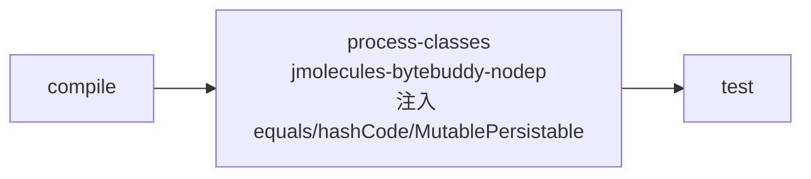
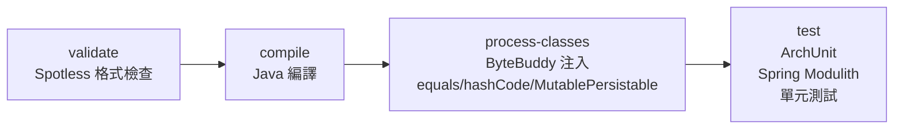

# Chapter 2：技術棧說明

## 總覽

| 類別 | 技術 | 版本 | 職責 |
|---|---|---|---|
| 語言 / 平台 | Java | 17 | — |
| 框架 | Spring Boot | 3.5.14 | 應用程式骨架 |
| Web | Spring Boot Starter Web | — | REST 端點 |
| API 規格 | OpenAPI Generator Maven Plugin | 7.12.0 | 從 YAML spec 產生 Spring server interface |
| 資料庫 | Spring Data MongoDB | — | 持久化 |
| DDD Annotations | jMolecules DDD | BOM 2025.0.2 | 在程式碼中表達 DDD 角色 |
| DDD Events | jMolecules Events | BOM 2025.0.2 | `@DomainEvent`、`@DomainEventHandler` |
| 架構風格 | jMolecules Onion Architecture | BOM 2025.0.2 | Onion 分層 annotation |
| 架構風格 | jMolecules CQRS Architecture | BOM 2025.0.2 | CQRS annotation |
| Spring 整合 | jMolecules Spring Integration | BOM 2025.0.2 | ByteBuddy 產生 Spring Data 相容程式碼 |
| Bytecode 轉換 | jMolecules ByteBuddy（nodep） | BOM 2025.0.2 | 編譯期自動產生樣板程式碼 |
| Bytecode 插件 | ByteBuddy Maven Plugin | 1.14.12 | 觸發 ByteBuddy 轉換的 Maven 插件 |
| 模組管理 | Spring Modulith Starter Core | 1.3.5 | Bounded Context 邊界驗證與文件 |
| 模組事件 | Spring Modulith Events API | 1.3.5 | `@ApplicationModuleListener` |
| 架構測試 | jMolecules ArchUnit | BOM 2025.0.2 | DDD / Onion 規則自動驗證 |
| 架構測試 | Spring Modulith Test | 1.3.5 | 模組結構測試 |
| 單元測試 | JUnit Jupiter | 5.12.2 | 單元測試框架（via spring-boot-starter-test） |
| 單元測試 | AssertJ | 3.27.7 | Fluent assertion（via spring-boot-starter-test） |
| 單元測試 | Mockito | 5.17.0 | Mock / Stub（via spring-boot-starter-test） |
| 程式碼格式 | Spotless + Google Java Format AOSP | 2.46.1 / 1.28.0 | 強制統一格式 |
| 樣板程式碼 | Lombok | 1.18.46 | `@Getter`、`@Builder` 等 |

---

## 核心技術詳解

### jMolecules — 讓程式碼說出 DDD 意圖

**問題**：DDD 概念（AggregateRoot、ValueObject 等）通常只存在文件和開發者腦中，程式碼本身無法表達。

**解法**：jMolecules 提供一組 annotation，讓你直接在 class 上標記它的 DDD 角色：

```java
@AggregateRoot                         // 這個 class 是 AggregateRoot
@Document(collection = "orders")
public class Order implements AggregateRoot<Order, OrderId> { ... }

@ValueObject                           // 這個 record 是 ValueObject
public record Money(BigDecimal amount, String currency) { ... }

@Repository                            // 這是 DDD Repository（非 Spring 的 @Repository）
public interface OrderRepository extends CrudRepository<Order, OrderId> { ... }
```

新人看到這些 annotation 就能立刻理解每個 class 的角色，不需要猜測。

**為何選 jMolecules 而非自訂 annotation？**  
jMolecules 已整合 ArchUnit、ByteBuddy、Spring Modulith——用自訂 annotation 需要自己建立這整套驗證機制。  
→ 詳見 [ADR 001](adr/001-use-jmolecules.md)

---

### jMolecules ArchUnit — 架構規則自動驗證

**問題**：架構規則（「Repository 只能管理 AggregateRoot」）通常靠 Code Review 守護，容易遺漏。

**解法**：jMolecules 提供與 ArchUnit 整合的預建規則，在 `mvn test` 時自動驗證：

```java
// JMoleculesArchitectureTest.java
@Test
void repositoriesShouldOnlyManageAggregateRoots() {
    // 自動掃描所有 @Repository，確認它們只管理 @AggregateRoot
    // OrderItemRepository 違反此規則 → 測試失敗並顯示原因
}
```

違規立即在 CI 阻擋，不依賴人工審查。本專案有 **7 個刻意失敗的測試**，用來展示各類違規。

---

### jMolecules ByteBuddy — 編譯期樣板程式碼產生

**問題**：Spring Data MongoDB 需要 `equals()`/`hashCode()` 基於 ID，Aggregate 也需要實作 `MutablePersistable`，這些都是重複的樣板程式碼。

**解法**：ByteBuddy Maven Plugin 在 `process-classes` 階段自動為有 jMolecules annotation 的 class 產生這些實作：



你只需要寫業務邏輯，`equals()`/`hashCode()` 自動產生。

**注意**：Spotless 格式檢查在 `validate` 階段（早於 `compile`），格式錯誤會在 ByteBuddy 執行前就終止建置。

---

### Spring Modulith — Bounded Context 邊界管理

**問題**：Bounded Context 的邊界容易在日積月累的需求中模糊，各 Context 開始互相依賴。

**解法**：Spring Modulith 把每個頂層 package（`catalog`、`customer`、`ordering`）視為獨立模組，並驗證模組間的依賴關係：

```java
// ModularityTest.java
@Test
void verifiesModularStructure() {
    // 驗證各 Context 的邊界沒有被破壞
    // BadOrder 因持有跨 Context 的 Customer 物件而失敗
}

@Test
void documentModules() {
    // 產生模組文件到 target/spring-modulith-docs/
}
```

產生的文件可以視覺化各模組的 public API 與依賴關係。

---

### Spring Data MongoDB — 持久化

本專案使用 MongoDB 作為持久化層，每個 AggregateRoot 對應一個 collection：

| AggregateRoot | Collection |
|---|---|
| `Order` | `orders` |
| `Product` | `products` |
| `Customer` | `customers` |

**為何用 MongoDB 而非關聯式資料庫？**  
MongoDB 的 document 模型天然對應 Aggregate 邊界——整個 `Order`（含內嵌的 `OrderItem` list）儲存為一個 document，不需要 JOIN，符合「Aggregate 是一致性邊界」的概念。

---

### Spotless + Google Java Format — 強制格式統一

格式化使用 Google Java Format AOSP style（4 spaces indent）。  
Spotless 在 Maven `validate` phase 執行，格式錯誤會**立即終止建置**，無法繞過：

```bash
mvn spotless:apply   # 自動修正格式
mvn spotless:check   # 只檢查，不修正（validate phase 執行的是這個）
```

**版本限制**：本專案使用 GJF **1.28.0**。GJF 1.30.0+ 不支援 JDK 17，升版前需確認 JDK 相容性。

---

### Lombok — 減少樣板程式碼

本專案使用 Lombok 的 `@Getter` 減少 getter 方法的撰寫量。  
ArchUnit 的 immutability 規則用**非 final 欄位**偵測可變性，  
這樣就算 Lombok `@Setter` 因 `RetentionPolicy.SOURCE` 在 bytecode 中不可見，也能正確偵測。

---

## 建置流程

