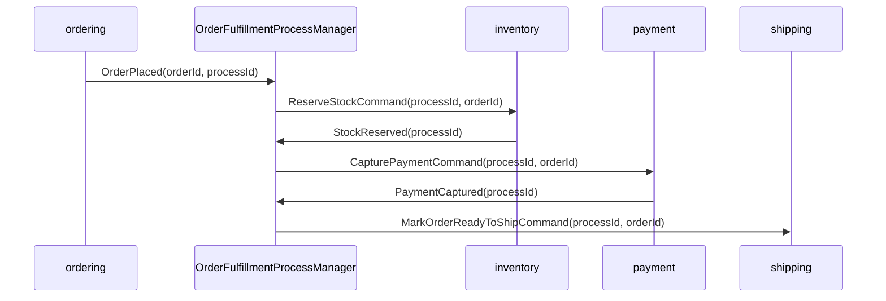
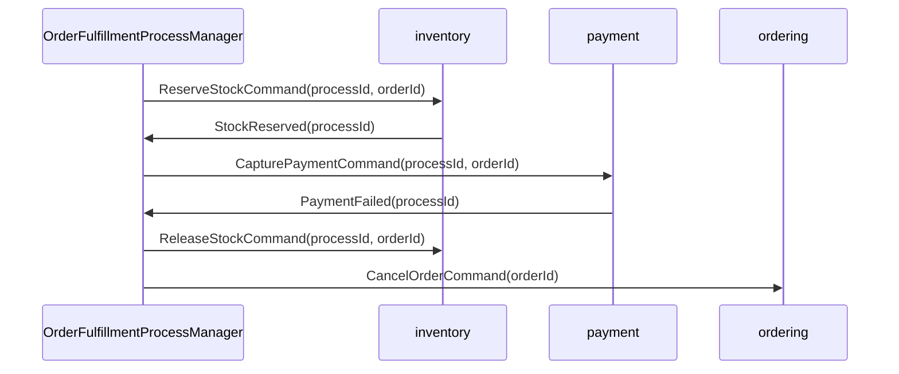

# Chapter 3.1：Process Manager / Saga 範例

本章以訂單履約流程示範 Process Manager / Saga 的結構。
重點是保存流程狀態、使用 correlation id 串接事件與 command、處理重送與補償，而不是把多個 Aggregate 包在同一個交易裡。

---

## 適用情境

Process Manager / Saga 適合有狀態的多步驟流程：

- 流程跨多個 Aggregate、Bounded Context 或外部系統
- 每一步可能成功、失敗、timeout 或重送
- 失敗時需要補償動作
- 需要追蹤整個流程的狀態與歷程

若只是「收到事件後做一個無狀態 side effect」，使用普通 listener 即可。

---

## 範例流程



失敗補償流程：



---

## 流程狀態

Process state 是流程協調用的 application state，不是 `Order` Aggregate 的內部狀態。

```java
public enum OrderFulfillmentStatus {
    STARTED,
    STOCK_RESERVING,
    STOCK_RESERVED,
    PAYMENT_CAPTURING,
    PAYMENT_CAPTURED,
    READY_TO_SHIP,
    COMPENSATING,
    CANCELLED,
    FAILED
}

public class OrderFulfillmentProcess {

    private UUID processId;
    private OrderId orderId;
    private OrderFulfillmentStatus status;
    private Set<String> handledMessageIds = new HashSet<>();

    public boolean hasHandled(String messageId) {
        return handledMessageIds.contains(messageId);
    }

    public void markHandled(String messageId) {
        handledMessageIds.add(messageId);
    }
}
```

`processId` / `correlationId` 讓每個事件、command 和 log 都能追蹤同一個流程。
`handledMessageIds` 用於冪等處理，避免同一事件重送時重複發 command。

---

## Process Manager

Process Manager 根據目前流程狀態決定下一步 command。
它不直接修改其他 Context 的資料庫，也不把多個 Aggregate 放進同一交易。

```java
@ApplicationServiceRing
public class OrderFulfillmentProcessManager {

    private final OrderFulfillmentProcessRepository processes;
    private final CommandBus commandBus;

    @ApplicationModuleListener
    public void on(OrderPlaced event) {
        OrderFulfillmentProcess process = processes.findOrCreate(event.processId(), event.orderId());
        if (process.hasHandled(event.messageId())) {
            return;
        }

        process.markHandled(event.messageId());
        process.startStockReservation();

        commandBus.dispatch(new ReserveStockCommand(
                event.processId(),
                event.orderId()));

        processes.save(process);
    }

    @ApplicationModuleListener
    public void on(StockReserved event) {
        OrderFulfillmentProcess process = processes.findById(event.processId()).orElseThrow();
        if (process.hasHandled(event.messageId())) {
            return;
        }

        process.markHandled(event.messageId());
        process.markStockReserved();

        commandBus.dispatch(new CapturePaymentCommand(
                event.processId(),
                process.orderId()));

        processes.save(process);
    }

    @ApplicationModuleListener
    public void on(PaymentCaptured event) {
        OrderFulfillmentProcess process = processes.findById(event.processId()).orElseThrow();
        if (process.hasHandled(event.messageId())) {
            return;
        }

        process.markHandled(event.messageId());
        process.markPaymentCaptured();

        commandBus.dispatch(new MarkOrderReadyToShipCommand(
                event.processId(),
                process.orderId()));

        processes.save(process);
    }
}
```

---

## 補償處理

補償不是 rollback。補償是用另一個明確 command 讓 owner Context 把狀態推進到可接受結果。

```java
@ApplicationModuleListener
public void on(PaymentFailed event) {
    OrderFulfillmentProcess process = processes.findById(event.processId()).orElseThrow();
    if (process.hasHandled(event.messageId())) {
        return;
    }

    process.markHandled(event.messageId());
    process.startCompensation();

    commandBus.dispatch(new ReleaseStockCommand(
            event.processId(),
            process.orderId()));

    commandBus.dispatch(new CancelOrderCommand(process.orderId()));

    processes.save(process);
}
```

補償規則：

- 補償 command 仍由 owner Context 處理
- 補償 command 也要具備冪等語意
- 補償失敗時要能重試或進入人工處理狀態
- Process state 必須保存目前卡在哪一步

---

## Timeout 與重試

Timeout 不依賴單次 listener 的記憶體狀態，而是透過 process state 查詢逾時流程。

```java
@Scheduled(fixedDelayString = "PT1M")
public void retryTimedOutProcesses() {
    processes.findTimedOutProcesses(Instant.now()).forEach(process -> {
        switch (process.status()) {
            case STOCK_RESERVING ->
                    commandBus.dispatch(new ReserveStockCommand(process.processId(), process.orderId()));
            case PAYMENT_CAPTURING ->
                    commandBus.dispatch(new CapturePaymentCommand(process.processId(), process.orderId()));
            case COMPENSATING ->
                    commandBus.dispatch(new ReleaseStockCommand(process.processId(), process.orderId()));
            default -> {
                // terminal states do not need retry
            }
        }
    });
}
```

---

## Review Checklist

- Process state 有 `processId` / `correlationId`
- 每個 listener 都有冪等檢查
- 每個對外 command 都有明確 owner Context
- 補償動作用 command 表達，不直接改別人的資料庫
- Timeout / retry 依賴持久化流程狀態，不依賴記憶體
- Terminal state 明確，例如 `READY_TO_SHIP`、`CANCELLED`、`FAILED`
- 普通無狀態 side effect 不命名為 `*ProcessManager` / `*Saga`
