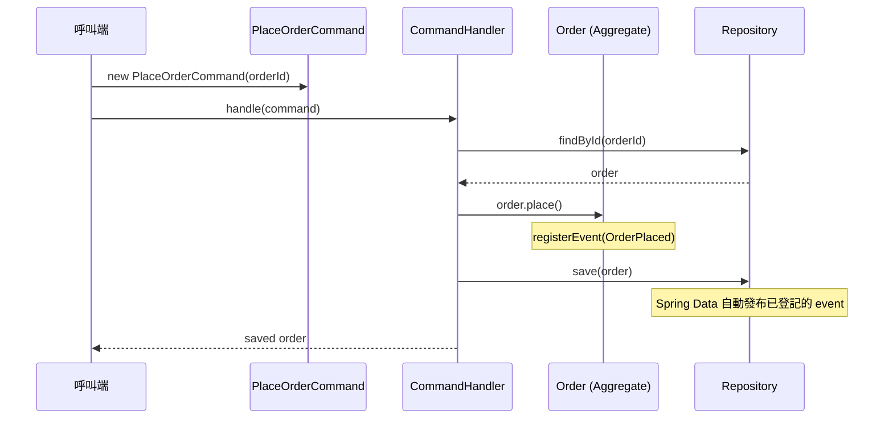

# Chapter 3：CQRS — 命令與查詢分離

## 什麼是 CQRS？

CQRS（Command Query Responsibility Segregation）的核心原則：

> **改變狀態的操作（Command）與讀取狀態的操作（Query）要分開。**

這個原則源自 Bertrand Meyer 的 CQS（Command Query Separation）：
- **Command**：執行動作，改變系統狀態，不回傳值（或只回傳執行結果）
- **Query**：讀取資料，不改變任何狀態，可以安全重複呼叫

CQRS 把這兩條路徑提升為架構層面的分離。

---

## 為什麼需要 CQRS？

傳統 Service 常見的問題：

```java
// 讀寫混雜在同一個 Service，越長越難維護
public class OrderService {
    public Order createOrder(...) { ... }           // 寫
    public Order findById(...) { ... }              // 讀
    public Order placeOrder(...) { ... }            // 寫
    public List<Order> findByCustomer(...) { ... }  // 讀
    public void cancel(...) { ... }                 // 寫
}
```

問題：
- 看到一個方法，不確定它有沒有 side effect
- 讀的邏輯和寫的邏輯互相影響，難以個別優化
- 測試困難——測試讀的邏輯時，可能意外觸發寫

CQRS 讓這個問題消失：**看到 Command 就知道有 side effect，看到 Query 就知道安全。**

---

## 核心概念

### Command — 操作意圖

代表「系統應該做什麼」，用**祈使句**命名（`CreateOrder`、`PlaceOrder`、`CancelOrder`）。

- 必須不可變——代表某一時刻確定的意圖，不應被修改後重送
- 通常不回傳業務資料（或只回傳 ID / 執行狀態）
- 一個 Command 對應一個明確的業務操作
- Command 是 application 層的 use case input，不是 HTTP request DTO，也不是 OpenAPI generated model
- 對外部可能重送的操作，Command 應有明確冪等策略

### Query — 讀取請求

代表「系統應該回傳什麼」，用**疑問式**或**讀取式**命名（`FindOrderById`、`GetCustomerOrders`）。

- 不改變任何狀態
- 可以安全重複呼叫，結果相同
- 可以針對讀取需求獨立優化（快取、索引、read model）
- Query path 不 dispatch command、不 publish domain event、不呼叫會修改 Aggregate 狀態的方法
- Query 回傳的是 read side contract，不必和 Aggregate 結構一樣

### Command Handler — 執行者

接收 Command，協調領域物件完成操作：

1. 從 Repository 取出相關的 Aggregate
2. 呼叫 Aggregate 上的業務方法
3. 儲存並發布 Domain Event

Handler 本身不含業務邏輯，業務邏輯在 Aggregate 裡。
一個 Command Handler 原則上只修改一個 Aggregate；跨 Aggregate 或跨 Context 的後續動作用事件、Process Manager 或 Saga 協調。
若 Command 可能與同一 Aggregate 的其他 Command 並發，Handler 要處理 optimistic locking failure、重試策略或回傳明確衝突錯誤。

### Validation 分層

不同驗證屬於不同層，不能全部塞進 Controller 或 Command Handler：

| 驗證類型 | 放置位置 | 例子 |
|---|---|---|
| Transport validation | Controller / API DTO | JSON 格式、必填欄位、字串長度、型別格式 |
| Use case validation | Application Service / Command Handler | 使用者是否可執行此操作、外部 reference 是否存在 |
| Domain invariant | Aggregate / Entity / ValueObject / Domain Service | 訂單只能從 `PENDING` 變成 `PLACED`、數量必須大於 0 |
| Cross-context validation | Application Service 透過 publicapi | 商品是否存在、顧客是否可下單 |

API validation 只能保證 request 長得合理；Domain invariant 才保證業務狀態永遠合法。

### 冪等性與重送

Command 可能因 HTTP retry、message retry 或使用者重複操作而被送出多次。
每個會被外部重送的 command 都要定義重送語意：

| 情境 | 可接受策略 |
|---|---|
| `CreateOrderCommand` 重送 | 使用 request id / client command id 去重，或回傳既有 order id |
| `PlaceOrderCommand` 重送 | 若訂單已成立，可視為成功或回傳明確錯誤，但規則要固定 |
| `CancelOrderCommand` 重送 | 若已取消，可視為成功或回傳明確錯誤 |

Event listener 也要具備冪等性，因為事件可能重送或重試。
不要假設「只會收到一次」。
本專案選擇讓 `PlaceOrderCommand` 對已成立訂單採 no-op 語意，不重複登記 `OrderPlaced`。

### 並發與衝突

CQRS 把寫入路徑集中在 Command Handler，但不代表 Command 會一個一個排隊。
同一個 Aggregate 可能同時收到多個 Command，因此要定義衝突處理方式：

| 情境 | 規範 |
|---|---|
| 兩個 Command 同時修改同一 Aggregate | 使用 optimistic locking 或資料庫版本欄位偵測衝突 |
| Command 重試 | 先檢查 command 是否具備冪等語意 |
| 版本衝突 | 重新載入再套用明確規則，或回傳 conflict 錯誤 |
| 跨 Aggregate 衝突 | 不開大交易；改用事件、Process Manager / Saga 或補償 |

若導入 Spring Data，可用 `@Version` 欄位展示 optimistic locking；若 demo 尚未實作，至少在規範與測試計畫中說明預期行為。
悲觀鎖是例外手段，只能用在同一資料庫交易內可控、競爭極高且重試 / 補償成本不可接受的 Command。
採用悲觀鎖時，必須在文件或 ADR 寫清楚鎖範圍、等待 timeout、deadlock 處理與壓力測試結果。

Command handler 使用悲觀鎖時，鎖只包住「載入 Aggregate → 執行 domain method → 儲存」這段最短臨界區。
不要在持鎖期間呼叫外部 API、發布同步整合請求、等待使用者輸入，或處理跨 Context 長流程。

```java
@CommandHandler
@Transactional(timeout = 3)
public void handle(PlaceOrderCommand command) {
    Order order = orderRepository.findByIdForUpdate(command.orderId())
            .orElseThrow(OrderNotFoundException::new);

    order.place();
    orderRepository.save(order);
}
```

若使用 MongoDB，文件範例建議用 lease lock 包住 command handler 的最短臨界區，而不是宣稱 Mongo 有 row-level pessimistic lock：

```java
@CommandHandler
public void handleWithLeaseLock(PlaceOrderCommand command) {
    LockToken token = orderLock.acquire(command.orderId(), Duration.ofSeconds(2), Duration.ofSeconds(10));
    try {
        Order order = orderRepository.findById(command.orderId()).orElseThrow();
        order.place();
        orderRepository.save(order);
    } finally {
        orderLock.release(token);
    }
}
```

### Read Model 與 Projection

CQRS 允許 read side 和 write side 使用不同模型。
QueryModel / projection 可以為了查詢需求反正規化，例如預先保存訂單列表需要的顧客名稱、商品名稱或總金額。

規則：

- read model 是查詢合約，不是 Aggregate
- projection 可以 eventual consistent，剛寫完資料不一定立刻反映在查詢結果中
- API 若讀 projection，要能接受短暫延遲或提供明確的 read-your-write 策略
- QueryModel 不為了補資料而觸發 command 或修改 write model
- projection 重建應可重跑，重複處理同一事件不能產生重複資料

### DTO 邊界 — CQRS 與 Web Adapter 分工

CQRS 的 Command / QueryModel 屬於 application 層；API request / response DTO 屬於 `infrastructure.web`。
兩者命名和欄位可能相似，但職責不同，不能混用。

| 物件 | 所在層 | 可以做什麼 | 不該做什麼 |
|---|---|---|---|
| API request DTO | infrastructure/web | 表達 HTTP payload | 被 application service 或 domain model 接收 |
| Command | `@ApplicationServiceRing` package | 表達 use case 意圖 | 直接拿來當 JSON response 或 OpenAPI model |
| QueryModel | application | 組裝 read side 資料 | 呼叫 CommandHandler、save/delete、publish event |
| API response DTO | infrastructure/web | 表達 HTTP response contract | 洩漏 Aggregate、Entity、Domain Event internal state |

Controller 是轉換邊界：

```java
// ✅ HTTP payload -> Application Command
@PostMapping("/orders")
ResponseEntity<OrderResponse> create(@RequestBody CreateOrderRequest request) {
    OrderId id = orderService.handle(
            new CreateOrderCommand(new CustomerReference(request.customerId())));
    return ResponseEntity.created(...).body(OrderResponse.from(id));
}
```

不要把 transport DTO 當成 use case input：

```java
// ❌ OpenAPI / REST DTO 不進 application
@CommandHandler
public Order handle(CreateOrderRequest request) { ... }
```

Command Handler 的回傳值也要克制。Production code 優先回傳 `void`、ID、簡單 result 或 application result DTO；
不要為了讓 Controller 方便序列化，就直接把 Aggregate 當 API response 暴露出去。

### 命名規則

CQRS 的命名要讓 side effect 一眼可見：

- Command 用祈使句：`CreateOrderCommand`、`PlaceOrderCommand`
- Event 用過去式：`OrderCreated`、`OrderPlaced`
- Query 用讀取語意：`FindOrderById`、`GetCustomerOrders`
- 不用模糊名稱如 `OrderManager`、`OrderProcessor`、`OrderData`，除非它對應明確的架構角色
- Process Manager / Saga 用流程名稱：`OrderFulfillmentProcessManager`、`PaymentReservationSaga`
- Read model / projection 用查詢語意：`OrderSummary`、`OrderSummaryProjection`

---

## 執行流程



Handler 是薄薄的協調層，真正的業務規則（「PENDING 才能 place」）在 `Order.place()` 裡。`Order` 繼承 `AbstractAggregateRoot`，`place()` 用 `registerEvent()` 在 domain 內部登記事件；Spring Data 在 `save()` 時自動發布，`OrderService` 無需注入 `ApplicationEventPublisher`。

---

→ 本專案的 jMolecules 實作方式見 [CQRS 實作說明](03-cqrs-impl.md)
