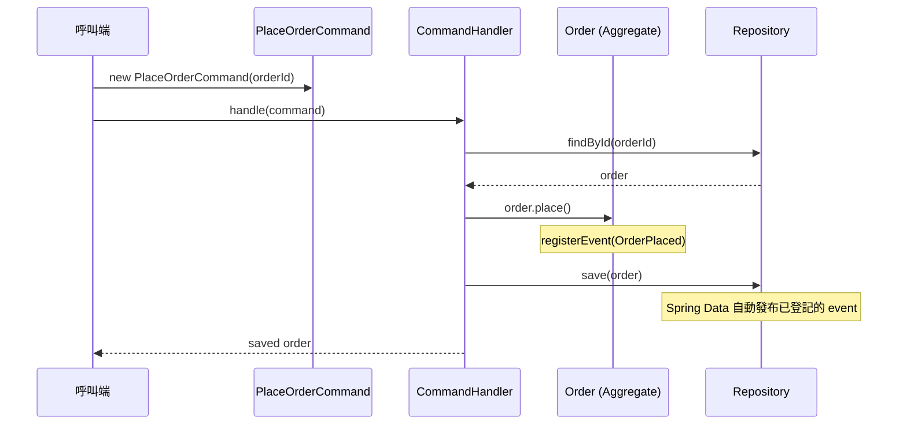

# Chapter 3：CQRS — 命令與查詢分離

## 什麼是 CQRS？

CQRS（Command Query Responsibility Segregation）的核心原則：

> **改變狀態的操作（Command）與讀取狀態的操作（Query）要分開。**

這個原則源自 Bertrand Meyer 的 CQS（Command Query Separation）：
- **Command**：執行動作，改變系統狀態，不回傳值（或只回傳執行結果）
- **Query**：讀取資料，不改變任何狀態，可以安全重複呼叫

CQRS 把這兩條路徑提升為架構層面的分離。

---

## 為什麼需要 CQRS？

傳統 Service 常見的問題：

```java
// 讀寫混雜在同一個 Service，越長越難維護
public class OrderService {
    public Order createOrder(...) { ... }           // 寫
    public Order findById(...) { ... }              // 讀
    public Order placeOrder(...) { ... }            // 寫
    public List<Order> findByCustomer(...) { ... }  // 讀
    public void cancel(...) { ... }                 // 寫
}
```

問題：
- 看到一個方法，不確定它有沒有 side effect
- 讀的邏輯和寫的邏輯互相影響，難以個別優化
- 測試困難——測試讀的邏輯時，可能意外觸發寫

CQRS 讓這個問題消失：**看到 Command 就知道有 side effect，看到 Query 就知道安全。**

---

## 核心概念

### Command — 操作意圖

代表「系統應該做什麼」，用**祈使句**命名（`CreateOrder`、`PlaceOrder`、`CancelOrder`）。

- 必須不可變——代表某一時刻確定的意圖，不應被修改後重送
- 通常不回傳業務資料（或只回傳 ID / 執行狀態）
- 一個 Command 對應一個明確的業務操作
- Command 是 application 層的 use case input，不是 HTTP request DTO，也不是 OpenAPI generated model

### Query — 讀取請求

代表「系統應該回傳什麼」，用**疑問式**或**讀取式**命名（`FindOrderById`、`GetCustomerOrders`）。

- 不改變任何狀態
- 可以安全重複呼叫，結果相同
- 可以針對讀取需求獨立優化（快取、索引、read model）
- Query path 不 dispatch command、不 publish domain event、不呼叫會修改 Aggregate 狀態的方法

### Command Handler — 執行者

接收 Command，協調領域物件完成操作：

1. 從 Repository 取出相關的 Aggregate
2. 呼叫 Aggregate 上的業務方法
3. 儲存並發布 Domain Event

Handler 本身不含業務邏輯，業務邏輯在 Aggregate 裡。

### DTO 邊界 — CQRS 與 Web Adapter 分工

CQRS 的 Command / QueryModel 屬於 application 層；API request / response DTO 屬於 `infrastructure.web`。
兩者命名和欄位可能相似，但職責不同，不能混用。

| 物件 | 所在層 | 可以做什麼 | 不該做什麼 |
|---|---|---|---|
| API request DTO | infrastructure/web | 表達 HTTP payload | 被 application service 或 domain model 接收 |
| Command | application/command | 表達 use case 意圖 | 直接拿來當 JSON response 或 OpenAPI model |
| QueryModel | application | 組裝 read side 資料 | 呼叫 CommandHandler、save/delete、publish event |
| API response DTO | infrastructure/web | 表達 HTTP response contract | 洩漏 Aggregate、Entity、Domain Event internal state |

Controller 是轉換邊界：

```java
// ✅ HTTP payload -> Application Command
@PostMapping("/orders")
ResponseEntity<OrderResponse> create(@RequestBody CreateOrderRequest request) {
    OrderId id = orderService.handle(
            new CreateOrderCommand(new CustomerReference(request.customerId())));
    return ResponseEntity.created(...).body(OrderResponse.from(id));
}
```

不要把 transport DTO 當成 use case input：

```java
// ❌ OpenAPI / REST DTO 不進 application
@CommandHandler
public Order handle(CreateOrderRequest request) { ... }
```

Command Handler 的回傳值也要克制。Production code 優先回傳 `void`、ID、簡單 result 或 application result DTO；
不要為了讓 Controller 方便序列化，就直接把 Aggregate 當 API response 暴露出去。

---

## 執行流程



Handler 是薄薄的協調層，真正的業務規則（「PENDING 才能 place」）在 `Order.place()` 裡。`Order` 繼承 `AbstractAggregateRoot`，`place()` 用 `registerEvent()` 在 domain 內部登記事件；Spring Data 在 `save()` 時自動發布，`OrderService` 無需注入 `ApplicationEventPublisher`。

---

→ 本專案的 jMolecules 實作方式見 [CQRS 實作說明](03-cqrs-impl.md)
