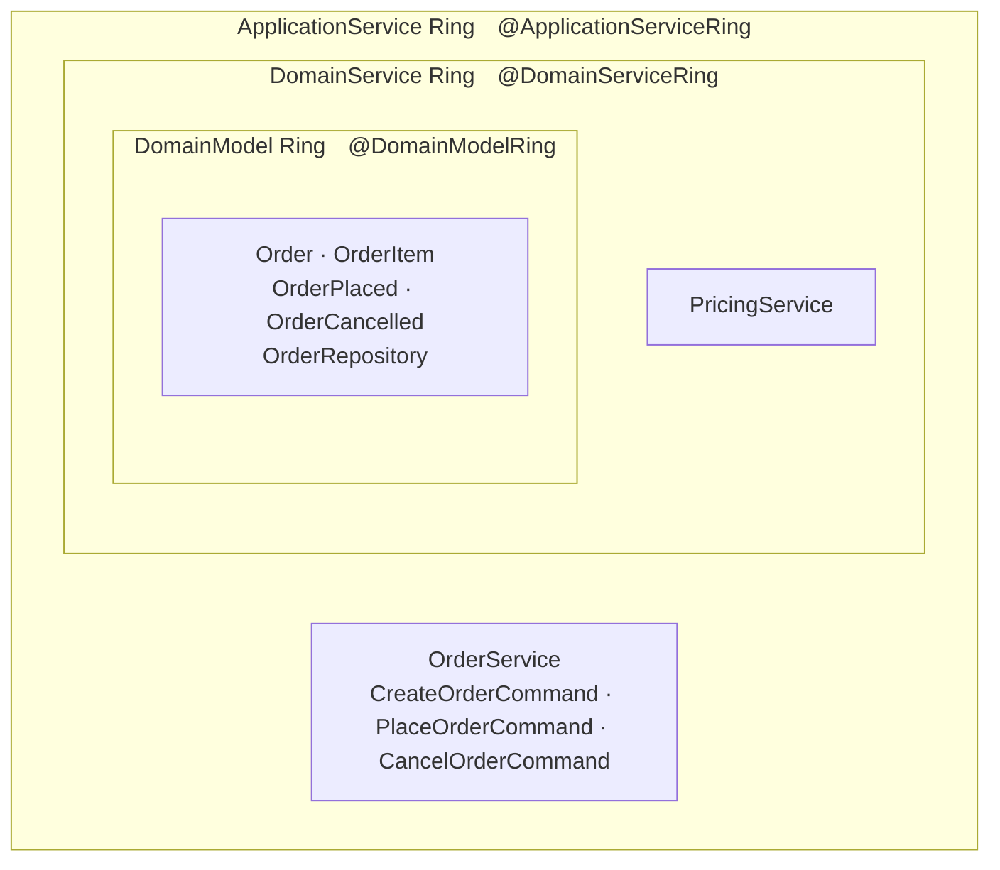

# Onion Architecture 實作說明 — 本專案對應

本文件說明本專案如何對應 [Onion Architecture 核心概念](04-onion.md)。

---

## Ring Annotation

jMolecules 用 package-level annotation 標記每個 ring，ArchUnit 的 `ensureOnionClassical()` 根據這些 annotation 驗證依賴方向：

| Ring | Annotation | 套件 |
|---|---|---|
| Domain Model | `@DomainModelRing` | `org.jmolecules.architecture.onion.classical` |
| Domain Service | `@DomainServiceRing` | `org.jmolecules.architecture.onion.classical` |
| Application Service | `@ApplicationServiceRing` | `org.jmolecules.architecture.onion.classical` |
| Infrastructure | `@InfrastructureRing` | `org.jmolecules.architecture.onion.classical` |

每個 sub-package 的 `package-info.java` 必須標記對應 ring，否則 ArchUnit 無法判斷層別。

---

## 本專案分層結構（ordering Context）



| 層 | Annotation | 本專案 class |
|---|---|---|
| DomainModel | `@DomainModelRing` | `Order`、`OrderItem`、`OrderPlaced`、`OrderRepository` |
| DomainService | `@DomainServiceRing` | `PricingService` |
| ApplicationService | `@ApplicationServiceRing` | `OrderService`、`*Command` |

---

## package-info.java 範例

```java
// ordering/domain/package-info.java
@DomainModelRing
package com.example.demo.ordering.domain;
import org.jmolecules.architecture.onion.classical.DomainModelRing;
```

```java
// ordering/domainservice/package-info.java
@DomainServiceRing
package com.example.demo.ordering.domainservice;
import org.jmolecules.architecture.onion.classical.DomainServiceRing;
```

```java
// ordering/application/package-info.java
@ApplicationServiceRing
package com.example.demo.ordering.application;
import org.jmolecules.architecture.onion.classical.ApplicationServiceRing;
```

---

## ArchUnit 驗證

`JMoleculesArchitectureTest.shouldFollowOnionArchitecture` 呼叫 `JMoleculesArchitectureRules.ensureOnionClassical()` 驗證依賴方向。本專案此測試**通過**（無非預期違規）。

```java
@ArchTest
ArchRule shouldFollowOnionArchitecture =
    JMoleculesArchitectureRules.ensureOnionClassical();
```
