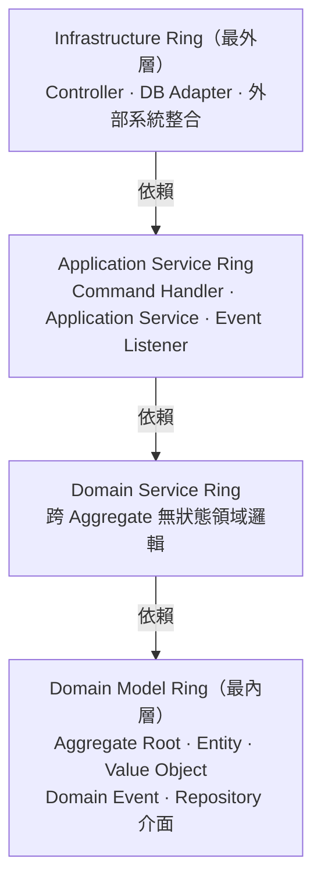
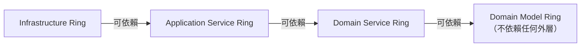

# Chapter 4：Onion Architecture — 洋蔥分層

Onion Architecture 定義 **Context 內部**的分層規則：依賴方向只能由外往內，內層不知道外層的存在。

---

## 為什麼需要分層？

沒有分層時，Application Service 可能直接操作資料庫，Domain Service 可能呼叫外部 API，最終業務邏輯散落各處，難以測試與替換。

分層的核心價值：
- **最內層純業務邏輯**，不依賴任何框架或 I/O
- **外層處理技術細節**（資料庫、HTTP、訊息佇列），可以被替換而不影響業務邏輯
- **每層只知道比自己更內層的存在**

---

## 四個環（Ring）



| Ring | 職責 | 典型內容 |
|---|---|---|
| **Domain Model** | 純業務邏輯，不依賴任何框架 | Aggregate Root、Entity、Value Object、Domain Event、Repository 介面 |
| **Domain Service** | 跨 Aggregate 的無狀態領域邏輯 | 計算服務（定價、折扣），只依賴 Domain Model |
| **Application Service** | 協調 Use Case 流程 | Command Handler、Application Service、Event Listener |
| **Infrastructure** | 技術細節實作 | Controller、資料庫 adapter、外部系統整合 |

---

## 依賴方向規則



**違規範例：**

```java
// ❌ Domain Model 依賴框架（外層）
@AggregateRoot
public class Order {
    @Autowired  // 不可在 Domain Model 注入 Spring Bean
    private OrderRepository repository;
}

// ✅ 正確：Domain Model 只操作自己的狀態，Repository 由 Application Service 呼叫
@AggregateRoot
public class Order extends AbstractAggregateRoot<Order> {
    public void place() {
        this.status = OrderStatus.PLACED;
        registerEvent(new OrderPlaced(this.id, Instant.now())); // 登記事件，save() 時自動發布
    }
}
```

### Adapter DTO 邊界

`infrastructure.web` 是 HTTP / OpenAPI adapter。API DTO、OpenAPI generated interface、Spring MVC annotation、JSON serialization concern 都只能留在這一層。
內層只能看見業務語言，不看見傳輸協議。

| Ring | 可以依賴 | 不可依賴 |
|---|---|---|
| Domain Model | 本 Context domain type、Shared Kernel、Java 標準型別 | Spring Web、OpenAPI generated DTO、Controller、Application Service、Repository implementation |
| Domain Service | Domain Model | Web/API DTO、Repository、外部 API client、Spring MVC |
| Application Service | Domain Model、Domain Service、Repository interface、Command / result type | Controller、HTTP status、OpenAPI generated DTO、infrastructure implementation |
| Infrastructure | Application Service、QueryModel、public API、domain ID/reference | 直接修改 Aggregate 內部狀態、繞過 use case 操作資料庫 |

常見錯誤：

```java
// ❌ application layer 依賴 web adapter DTO
public Order handle(CreateOrderRequest request) { ... }

// ❌ domain layer 依賴 transport contract
public void place(PlaceOrderApiModel apiModel) { ... }
```

正確做法是在 Controller 或 mapper 做轉換：

```java
// ✅ web adapter 將 transport contract 轉成 application command
var command = new PlaceOrderCommand(new OrderId(request.orderId()));
orderService.handle(command);
```

---

→ 本專案的分層實作見 [Onion Architecture 實作說明](04-onion-impl.md)
