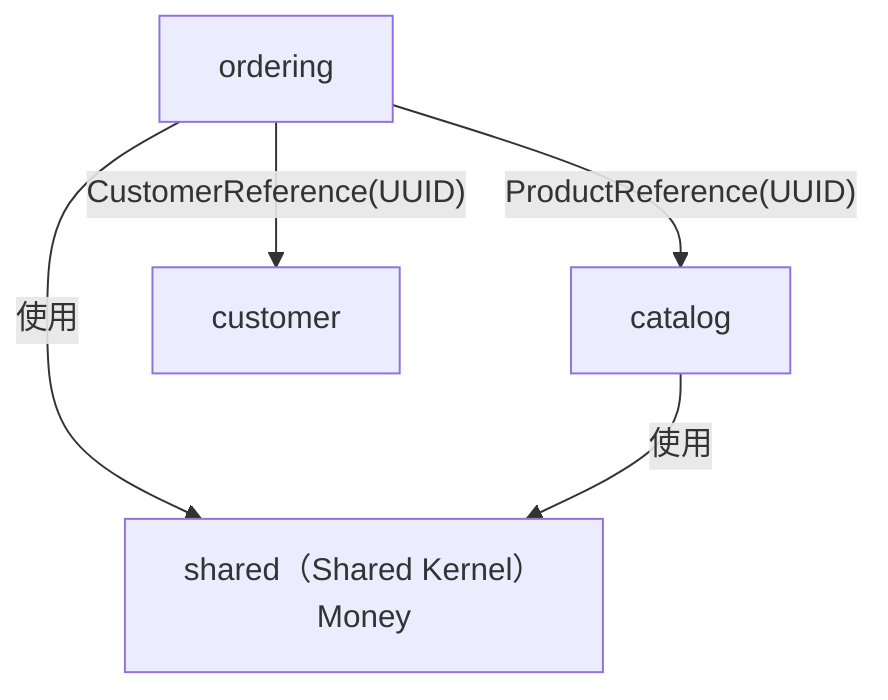

# Chapter 6：跨 Bounded Context 存取資料的設計模式

跨模組存取資料是最常被低估的架構問題。單個 Bounded Context 內的分層規則容易遵守，
但當 `ordering` 需要「顧客名稱」、`catalog` 需要「訂單數量」時，該怎麼做往往缺乏明確指引。

---

## 問題背景：Spring Modulith 的可見性規則

Spring Modulith 把每個**頂層 package**（如 `com.example.demo.catalog`）視為一個獨立模組。
模組根 package 下直接放置的 class 是公開 API；**sub-package**（如 `catalog.application`、`catalog.domain`）
預設是 **internal**，只有模組自己可以使用。

```
com.example.demo
├── catalog/                  ← 模組根：公開 API 放這裡
│   ├── application/          ← internal（Spring Modulith 不允許外部直接 import）
│   │   └── ProductService.java
│   └── domain/               ← internal
│       └── Product.java
├── ordering/                 ← 模組根
│   └── application/          ← internal
│       └── OrderService.java
```

Spring Modulith 的 `ApplicationModules.verify()` 會在測試時掃描所有 import，
若發現跨模組存取 internal 類別，立即報錯並指出違規的程式行。

---

## 反模式（Anti-patterns）

### 反模式 A：直接 import 另一個模組的 sub-package

```java
// ❌ ordering/application/OrderService.java
import com.example.demo.catalog.application.ProductService;  // 直接 import internal sub-package

@Service
public class OrderService {
    private final ProductService productService;  // ordering 與 catalog 內部結構緊耦合

    public void createOrder(CreateOrderCommand cmd) {
        Product product = productService.findById(cmd.productId());  // 問題：catalog 重構後 ordering 跟著壞
    }
}
```

**問題：**
- `catalog.application` 是 catalog 的實作細節，不是對外合約
- `catalog` 任何內部重構（方法簽章、class 移動）都會波及 `ordering`
- Spring Modulith `verify()` 直接報錯

---

### 反模式 B：用 `@NamedInterface` 暴露 sub-package

Spring Modulith 提供 `@NamedInterface` 讓你把 sub-package 標記為「具名介面」，允許外部依賴。
這是技術上可行的逃生門，但**不是首選**：

```java
// ❌ catalog/application/package-info.java
@NamedInterface("catalog-service")        // 把 application 層暴露出去
package com.example.demo.catalog.application;

// ordering 的 pom / Spring Modulith 設定中宣告依賴
// 此時 ordering 可以 import catalog.application.ProductService
```

**為何這是 escape hatch 而非首選：**

| 面向 | `@NamedInterface` | 正確做法（模組根公開 API） |
|---|---|---|
| **封裝性** | 暴露整個 sub-package，應用層細節外洩 | 只暴露刻意設計的 API class |
| **演進成本** | sub-package 重構仍影響所有使用者 | 根 package 的 API class 可穩定不變 |
| **意圖明確性** | 「這個 package 恰好被需要」 | 「這是我刻意對外公開的合約」 |
| **適用情境** | 程式庫模組、framework 整合點 | 業務模組之間的日常存取 |

---

### 反模式 C：DTO 洩漏 domain 型別

```java
// ❌ catalog 對外的回應 DTO
public record ProductResponse(
    UUID id,
    String name,
    ProductCategory category,  // ❌ 暴露 domain enum，外部模組依賴 catalog.domain 內部型別
    Money price                 // ❌ 雖然 Money 在 shared，但若換成 catalog-specific VO 就漏了
) {}

// ❌ ordering 拿到後反向依賴
import com.example.demo.catalog.domain.ProductCategory;  // ordering 被迫 import catalog 的 domain

public class OrderSummary {
    private ProductCategory category;  // 兩個模組的型別系統耦合在一起
}
```

**問題：** `ProductCategory` 是 catalog 的 domain 術語。若 catalog 把它拆成兩個 enum，
所有使用 `ProductResponse` 的地方都要一起改。

---

## 正確做法（Patterns）

### Pattern 1：公開 API 放在模組根 package

每個模組只在**根 package** 放刻意對外公開的 class（通常是一個 Application Service 介面或 Facade）：

```
catalog/                          ← 根 package（外部可見）
  ProductQueryFacade.java         ← ✅ 公開 API，不包含 domain 細節
  application/                    ← internal
    ProductService.java
  domain/                         ← internal
    Product.java
    ProductCategory.java
```

```java
// ✅ catalog/ProductQueryFacade.java（根 package，公開）
@Component
public class ProductQueryFacade {

    private final ProductQueryModel productQueryModel;

    public Optional<ProductSummary> findById(UUID id) {
        return productQueryModel.findById(new ProductId(id))
                .map(this::toSummary);
    }

    private ProductSummary toSummary(Product p) {
        return new ProductSummary(
            p.getId().id(),
            p.getName(),
            p.getCategory().name(),  // ✅ enum 轉 String，不洩漏 domain 型別
            p.getPrice().amount(),
            p.getPrice().currency()
        );
    }
}
```

`ordering` 只需 import `catalog.ProductQueryFacade`，完全不知道 `catalog.application` 或 `catalog.domain` 的存在。

---

### Pattern 2：DTO 只用 primitive 型別

跨模組 DTO（Summary / Response）只能包含：`String`、`Long`、`UUID`、`int`、`boolean`、以及其他 primitive 或 wrapper。

```java
// ✅ catalog/ProductSummary.java（根 package，公開）
public record ProductSummary(
    UUID id,
    String name,
    String category,   // ✅ String，不是 ProductCategory enum
    BigDecimal amount, // ✅ primitive-like，不是 Money VO
    String currency
) {}
```

**規則：** 若欄位型別需要 import 某個模組的 sub-package，就是洩漏。
`Money` 放在 `shared` 是跨 context 合法共用的例外，但 catalog-specific 的 VO 不行。

---

### Pattern 3：職責分離，一個 API class 一個職責

不要把所有功能塞進一個 Facade。按**存取模式**分開：

```java
// ✅ customer/CustomerQueryFacade.java — 只做讀取
@Component
public class CustomerQueryFacade {
    public Optional<CustomerSummary> findById(UUID id) { ... }
    public List<CustomerSummary> findAll() { ... }
}

// ✅ customer/CustomerAuthService.java — 只做認證相關
@Component
public class CustomerAuthService {
    public boolean isActive(UUID customerId) { ... }
    public Optional<UUID> findByEmail(String email) { ... }
}
```

**好處：**
- 各 consumer 只依賴自己真正需要的 API
- 測試時只需 mock 最小的接口
- 日後拆分模組時邊界更清晰

---

### Pattern 4：shared vs 模組根 package 的選擇

| 類型 | 放哪裡 | 判斷依據 |
|---|---|---|
| `Money`、`PageRequest` 等無 owner 的 cross-cutting 型別 | `shared/` | 多個模組都需要，沒有哪個模組有「所有權」 |
| `ProductSummary`、`CustomerSummary` 等 DTO | 對應模組根 package | 有明確 owner（catalog 定義 ProductSummary，不是 shared 決定） |
| `ProductCategory`、`OrderStatus` 等 domain enum | 對應模組的 `domain/`（internal） | 屬於 domain 細節，不對外公開 |
| `CustomerId`、`ProductId` 等 ID 型別 | 對應模組的 `domain/`（internal） | 只有該模組自己用；外部用 Reference Object 或 UUID |

**關鍵問題：** 「誰負責維護這個型別的演進？」

有明確 owner → 放在 owner 的模組（根 package 或 sub-package，視是否需要對外公開）。  
沒有 owner，大家平等使用 → 放 `shared/`。

---

## Spring Modulith verify() 的作用

`ApplicationModules.verify()` 在每次 `ModularityTest` 執行時自動驗證：

1. **跨模組 import 檢查**：掃描所有 class 的 import，對應到模組邊界，回報 internal 類別被外部存取的違規
2. **循環依賴偵測**：若模組 A 依賴模組 B，同時模組 B 依賴模組 A，立即報錯
3. **文件產生**：`documentModules()` 產生模組互動圖到 `target/spring-modulith-docs/`，視覺化哪些模組互相依賴

```java
// src/test/java/com/example/demo/ModularityTest.java
class ModularityTest {

    ApplicationModules modules = ApplicationModules.of(DemoApplication.class);

    @Test
    void verifiesModularStructure() {
        modules.verify();  // 違規 → 測試立即失敗，附帶違規詳情
    }

    @Test
    void documentModules() throws Exception {
        new Documenter(modules).writeDocumentation();
    }
}
```

**verify() 的錯誤訊息範例：**

```
Module 'ordering' depends on non-exposed type
  com.example.demo.catalog.application.ProductService
  in com.example.demo.ordering.application.OrderService.createOrder()
```

這讓問題在測試階段就浮現，而非在 code review 或生產環境才發現。

---

## 本專案的實際做法

本專案（`ordering` → `catalog` / `customer`）採用 **Reference Object** 模式，
而非跨模組呼叫 Application Service，因為 `ordering` 在建立訂單時只需要 ID，不需要展示資料：



### 什麼時候用 Reference Object，什麼時候用 Facade？

| 情境 | 做法 |
|---|---|
| 只需要記錄「是誰」，不需要展示資料 | Reference Object（`@ValueObject record XxxReference(UUID id)`） |
| 需要從另一個模組讀取展示用資料（名稱、狀態） | 模組根 Facade（`ProductQueryFacade.findById(UUID)`） |
| 需要跨模組觸發業務邏輯 | Domain Event（`ordering` 發布 `OrderPlaced`，其他模組監聽） |

### Reference Object 模式（本專案現行做法）

```java
// ✅ ordering/domain/CustomerReference.java
@ValueObject
public record CustomerReference(UUID id) {}
// 只記錄 ID，不 import customer 的任何型別

// ✅ ordering/domain/ProductReference.java
@ValueObject
public record ProductReference(UUID id) {}

// ✅ ordering/domain/Order.java — 接受 UUID，包裝成 Reference
public Order(UUID customerId) {
    this.customer = new CustomerReference(customerId);
}
```

**為何不直接存 `CustomerId`：**
- `CustomerId implements Identifier` → ByteBuddy 對欄位加 `@Id` → `Order` 出現兩個 `@Id`，MongoDB 啟動時 `MappingException`

### 若需要讀取展示資料（未來擴充）

若 `ordering` 的訂單明細頁面需要顯示商品名稱，正確做法是在 `catalog` 根 package 建立 Facade：

```java
// ✅ catalog/ProductQueryFacade.java（根 package，公開）
@Component
public class ProductQueryFacade {
    public Optional<ProductSummary> findById(UUID id) { ... }
}

// ✅ catalog/ProductSummary.java（根 package，公開 DTO）
public record ProductSummary(UUID id, String name, String category, BigDecimal amount, String currency) {}

// ✅ ordering 的 Application Service 可以合法 import
import com.example.demo.catalog.ProductQueryFacade;   // 根 package，公開
import com.example.demo.catalog.ProductSummary;       // 根 package，公開
// ❌ 不可以：
// import com.example.demo.catalog.application.ProductService;   // sub-package，internal
// import com.example.demo.catalog.domain.Product;               // sub-package，internal
```

---

## Violation Demo：跨 Context 邊界違規

本專案保留了刻意違規的 `BadOrder`，同時展示 ArchUnit 和 Spring Modulith 如何從不同角度偵測同一個問題：

```java
// ❌ ordering/BadOrder.java — 刻意違規，展示用
public class BadOrder {
    private Customer customer;  // 直接持有另一個 Context 的 Aggregate 物件
}
```

| 工具 | 偵測角度 | 觸發規則 |
|---|---|---|
| **ArchUnit** | DDD 規則：Aggregate 不可直接持有其他 AggregateRoot | `shouldFollowDddRules` |
| **Spring Modulith** | 模組邊界：`ordering` 直接 import `customer.domain.Customer`（internal） | `verifiesModularStructure` |

同一個違規，兩套工具從不同層次抓到，互相補充。

---

→ 跨 Context 的 Reference Object 實作細節見 [DDD 實作說明 — 跨 Context 邊界](01-ddd-impl.md#跨-context-邊界)
